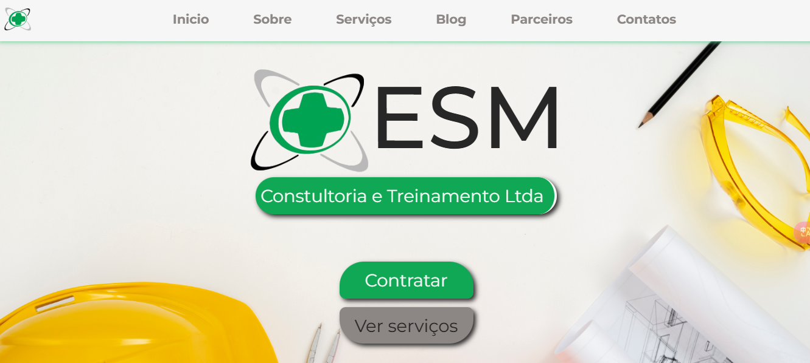

# ESM Institucional

[](https://www.consultoriaesm.com.br/)

Site institucional desenvolvido para a **ESM Consultoria e Treinamento**, focada em Segurança do Trabalho.

🔗 Acesse a versão online: [consultoriaesm.com.br](https://www.consultoriaesm.com.br/)

---

## 🖼️ Prévia do site




---

## 🛠️ Tecnologias utilizadas

- **Frontend**: Angular, TypeScript  
- **Estilização**: Bootstrap, CSS, Canva (imagens e ícones)  
- **Animações**: CSSAnimation.io  

---

## 🚀 Estrutura do projeto

```
esm-institucional/
├── src/
│   ├── app/
│   │   ├── components/       # Cabeçalho, rodapé, seções
│   │   ├── services/         # Fonte das notícias presentes em Blog
│   │   └── app.module.ts
│   ├── assets/               # Imagens, logos, ícones
│   └── styles.css            # Estilos globais
├── angular.json
├── package.json
└── README.md
```

---

## ⚙️ Como executar localmente

1. Clone o repositório:
   ```bash
   git clone https://github.com/devguilherme-b/esm-institucional.git
   cd esm-institucional
   ```
2. Instale as dependências:
   ```bash
   npm install
   ```
3. Inicie o servidor:
   ```bash
   ng serve
   ```
4. Acesse `http://localhost:4200` no navegador.

---

## 📌 Funcionalidades / seções

- Cabeçalho 
- Início  
- Sobre  
- Serviços  
- Blog  
- Parceiros  
- Contatos  
- rodapé.

---

## 📐 Design e acessibilidade

- Layout responsivo com **Bootstrap Grid**  
- Paleta de cores e tipografia coerentes com identidade visual  
- Imagens otimizadas via Canva  
- Animações leves com CSSAnimation.io  
- Acessibilidade básica: contraste, navegação por teclado e uso de `alt` em imagens

---

## ✅ Checklist de melhorias

- [ ] Otimização SEO (title, meta tags, sitemap)
- [ ] Deploy automático via CI/CD (integração com Vercel)

---

## 👍 Contribuição

1. Crie uma branch:
   ```bash
   git checkout -b feature/nova-funcionalidade
   ```
2. Faça as alterações e commit:
   ```bash
   git commit -m "Adiciona nova funcionalidade"
   ```
3. Envie para o repositório remoto:
   ```bash
   git push origin feature/nova-funcionalidade
   ```
4. Abra um Pull Request


---

## 📢 Post no LinkedIn

```
🚀 Primeiro Projeto Publicado! 🚀

Hoje compartilho com vocês o meu primeiro projeto real publicado: o site da ESM Consultoria e Treinamentos Ltda 🌐💻.

Esse projeto foi um grande aprendizado na minha carreira como desenvolvedor, pois além de criar um site institucional moderno e bem estruturado, utilizei TypeScript e Angular, tecnologias que ainda não domino completamente, o que me desafiou a aprender na prática.

🔹 Destaques do site

✅ Design moderno e funcional, com seções intuitivas: Início, Sobre, Serviços, Blog, Parceiros e Contatos  
✅ Blog dinâmico – cada notícia leva a uma página única, gerada automaticamente com base no conteúdo  
✅ Botões de compartilhamento e contato – mensagens pré-preenchidas para facilitar a interação no WhatsApp e outras plataformas

🛠 Tecnologias utilizadas

✔️ HTML5 e CSS3 – estrutura e estilização do site  
✔️ TypeScript e Angular – desenvolvimento de um front-end dinâmico e interativo  
✔️ Git, GitHub e Vercel – controle de versão, hospedagem e deploy contínuo para atualizações frequentes

💡 Agradecimento especial ao Edval Matias pela confiança e a oportunidade incrível! 🙌

```
> Confira em: [linkedin.com/in/devguilhermebarbosa](https://www.linkedin.com/posts/devguilhermebarbosa_programaaexaeto-fullstack-angular-activity-7310138878365978624-pdu-?utm_source=social_share_send&utm_medium=member_desktop_web&rcm=ACoAAFDAkqQBDKPBHV5551TEhmJmSNh41KFSJR4)
 
## 📬 Meios de Contato

- **Email**: [devguilhermebarbos@gmail.com](mailto:devguilhermebarbos@gmail.com)  
- **LinkedIn**: [linkedin.com/in/devguilhermebarbosa](https://linkedin.com/in/devguilhermebarbosa)  
- **GitHub**: [github.com/devguilherme-b](https://github.com/devguilherme-b)

---


🧠 Sinta-se à vontade para `sugerir melhorias` ou `contribuir com o projeto! `